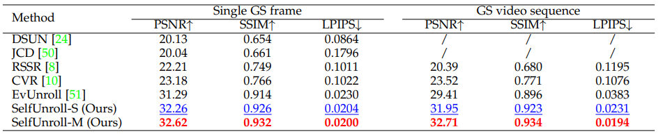

# SelfUnroll : Self-Supervised Scene Dynamic Recovery from Rolling Shutter Images and Events
## [Paper](https://arxiv.org/abs/2304.06930) | [Website](https://w3un.github.io/selfunroll/)

Scene Dynamic Recovery (SDR) by inverting distorted Rolling shutter (RS) images to an undistorted high frame-rate Global Shutter (GS) video is a severely ill-posed problem due to the missing temporal dynamic information in both RS intra-frame scanlines and inter-frame exposures, particularly when prior knowledge about camera/object motions is unavailable. Commonly used artificial assumptions on scenes/motions and data-specific characteristics are prone to producing sub-optimal solutions in real-world scenarios. To address this challenge, we propose an event-based SDR network within a self-supervised learning paradigm, i.e., SelfUnroll. We leverage the extremely high temporal resolution of event cameras to provide accurate inter/intra-frame dynamic information. Specifically, an Event-based Inter/intra-frame Compensator (E-IC) is proposed to predict the per-pixel dynamic between arbitrary time intervals, including the temporal transition and spatial translation. Exploring connections in terms of RS-RS, RS-GS, and GS-RS, we explicitly formulate mutual constraints with the proposed E-IC, resulting in supervisions without ground-truth GS images. Extensive evaluations over synthetic and real datasets demonstrate that the proposed method achieves state-of-the-art and shows remarkable performance for event-based RS2GS inversion in real-world scenarios.


<center>
<div style="color:orange; border-bottom: 1px solid #d9d9d9;
    display: inline-block;
    color: #000;
    padding: 2px;">
      Quantitative comparisons on Gev-RS dataset
  	</div>
    
    <br>
    
</center>

## Environment setup
- Python 3.8.0
- Pytorch 1.11.0
- NVIDIA GPU + CUDA 11.2
- numpy, argparse

You can create a new [Anaconda](https://www.anaconda.com/products/individual) environment as follows.
<br>
```
conda create -n selfunroll python=3.8
conda activate selfunroll
```
Clone this repository.
```
git clone git@github.com:w3un/selfunroll_code.git
```
Install the above dependencies.
```
cd selfunroll
pip install -r requirements.txt
```

## Download model and data
[Pretrained models](https://drive.google.com/drive/folders/1Jsm5zMQT7VSzmh682X1MaIEZ5U-y_-AA?usp=sharing) can be downloaded via Google Drive.
<br>
In our paper, we conduct experiments on three types of data:
- **Fastec-RS** contains synthetic RS images from [DeeplUnrollNet](https://github.com/ethliup/DeepUnrollNet). We first convert low frame rate into high frame rate GS videos using [Superslomo](https://github.com/avinashpaliwal/Super-SloMo), and then generate events by [V2E](https://github.com/SensorsINI/v2e).
- **Gev-RS** contains synthetic RS images and synthetic events from [EvUnroll](https://github.com/zxyemo/EvUnroll), where RS images are generated using the same manner as Fastec-RS.
- **Gev-Real-RS** contains real-world RS images and real-world events from [EvUnroll](https://github.com/zxyemo/EvUnroll).
- We built a real-world dataset **DRE** which contains real-world RS images and real-world events. (The data is coming soon.)


## Quick start
### Initialization
- Change the parent directory
```
cd selfunroll_code
```
- Copy the pretrained model to directory './PreTrained/'

### Test
```
cd script
```
(Please replace the parameter "RSpath" with the place where the dataset is downloaded.)

- Test on Fastec data
```
python test.py --Dataset Fastec --RSpath path_of_data  --test_unroll_path ../PreTrained/fast.pth --result_path ../result/fastec/ 
```
- Test on Gev data
```
python test.py --Dataset Gev --RSpath path_of_data --test_unroll_path ../PreTrained/gev.pth --result_path ../result/gev/  
```
- Test on Gev-Real data
```
python test.py --Dataset Gevreal --RSpath path_of_data --test_unroll_path ../PreTrained/gevreal.pth --result_path ../result/gevreal/ 
```
- Test on DRE data
```
python test.py --Dataset Drereal --RSpath path_of_data --test_unroll_path ../PreTrained/dre.pth --result_path ../result/dre/ 
```
**Main Parameters:**
- `--Dataset` : dataset name.
- `--RSpath` : path of dataset.
- `--test_unroll_path` : path of pretrain model.
- `--save_path` : path of reconstruction results.
- `--target` : timestamp of target GS frame (0/1 represents the exposure time of first/last scanline).

## Citation
If you find our work useful in your research, please cite:

```
@article{wang2023self,
        title={Self-Supervised Scene Dynamic Recovery from Rolling Shutter Images and Events},
        author={Wang, Yangguang and Zhang, Xiang and Lin, Mingyuan and Yu, Lei and Shi, Boxin and Yang, Wen and Xia, Gui-Song},
        journal={arXiv},
        year={2023}
        }
```
